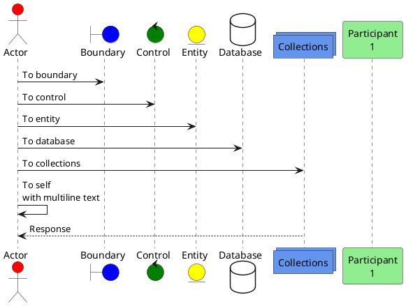
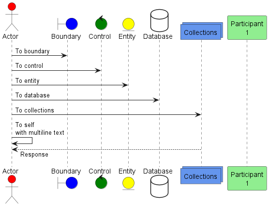
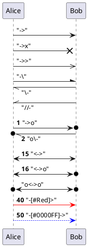
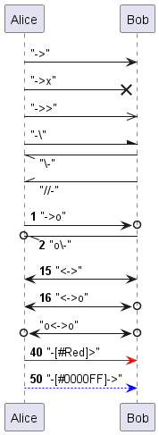
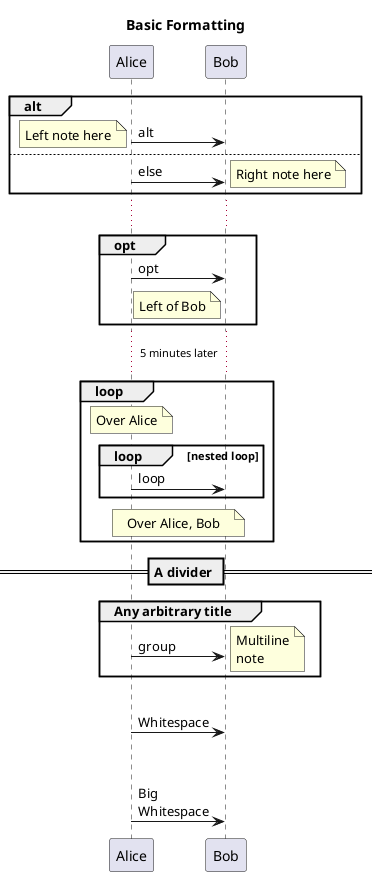
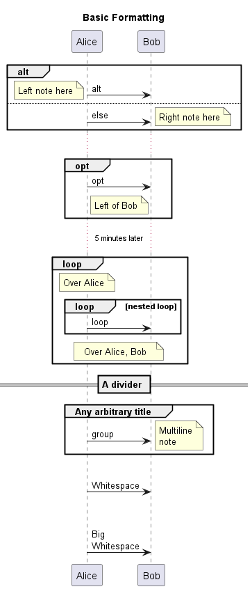
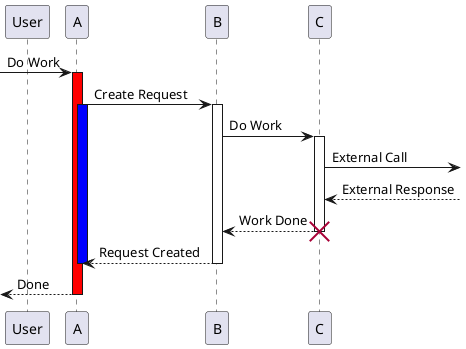
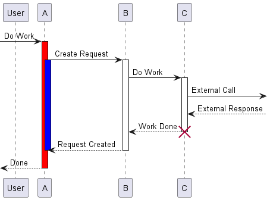
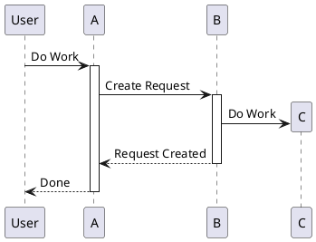
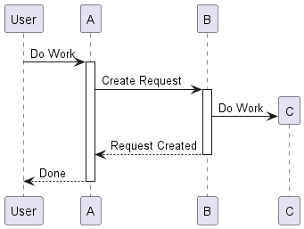

# Plant UML
[Full Documentation](https://pdf.plantuml.net/1.2020.22/PlantUML_Language_Reference_Guide_en.pdf)

## Sequence Diagrams
### Basic
**Diagram Basics**

**Basic Arrows**

**Basic Formatting**

### Lifelines
**Lifelines**

**Autoactivate**

